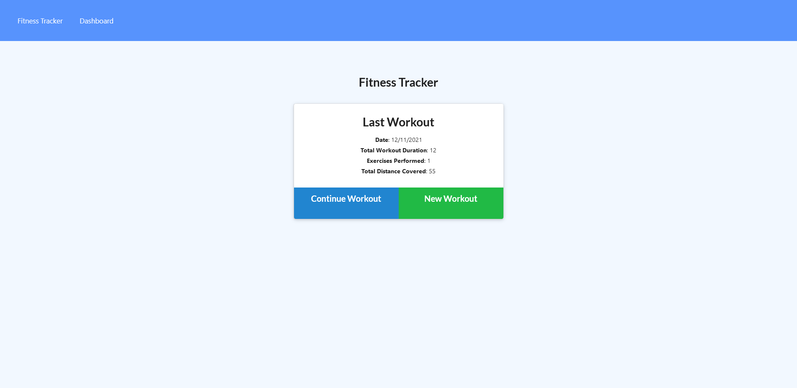

# Workout-Tracker   

## Table of Contents  

* [Installation](#installation)
* [Description](#description)
* [URLs](#urls)
* [Usage](#usage)
* [Images](#images)
* [Credits](#credits)
* [License](#license)
* [Contributions](#contributions)
* [Tests](#tests)
* [Questions](#questions)

## Installation  

no need to install, there is a dedicated webpage.  

## Description  

An application for tracking your daily workouts. Type in the type of workout, its name, weights, sets, reps, and how long you performed the activity. It will conveniently keep the data in a noSQL mongoDB database and show your current workouts for the past 7 days.  

## URLs  

GitHub repository: https://github.com/ajlineb/WorkOut-Tracker  

Webpage: https://limitless-island-47621.herokuapp.com  

## Usage  

Keeps track of all your workouts from past 7 days and shows the total workout times.  

## Images  

  

## Credits  

UNC Chapel Hill bootcamp for starter code  

## License  

MIT License  

## Contributions  

Send an email for thoughts and suggestions  

## Tests  

n/a  

## Questions  

Contact by:  
GitHub Username: [ajlineb](https://github.com/ajlineb)  
Email: anthonylinebaugh95@gmail.com